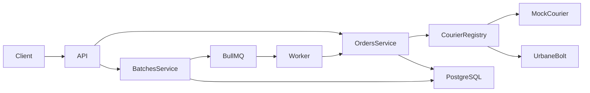
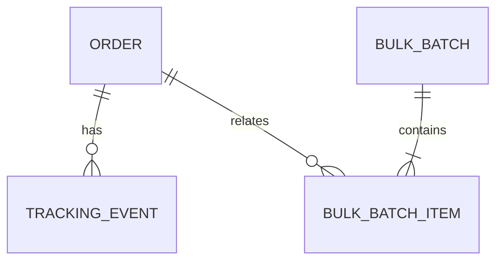

# Multi-Courier Integration Platform

## Goals

Expose one stable shipment API, isolate courier contracts, prevent concurrent duplicate creation, and handle bulk requests outside HTTP request lifetime. The project intentionally stays as one deployable NestJS application for a two-day assessment.

## Architecture

Controllers use normalized DTOs. `OrdersService` asks `CourierRegistry` for an adapter and has no partner conditionals. Each adapter owns mapping and raw transport data. The mock adapter is a complete second implementation; UrbaneBolt is a contract-safe skeleton pending its UAT specification.

## Order creation and idempotency

The service canonicalizes the normalized request, hashes it with SHA-256, and attempts to insert a `PROCESSING` order. The unique database constraint on `order_id` determines which request owns the external call. Matching completed requests return the stored result, matching in-flight requests return `ORDER_IN_PROGRESS`, and different hashes return `ORDER_ID_CONFLICT`.

The reservation and final result are separate transactions because the database transaction must not remain open during courier I/O. This prevents concurrent calls but cannot prove the external outcome after a process crash. A courier-side idempotency key should be supplied when the real contract supports one.

## Persistence model

Orders store normalized input, a request hash, current states, and raw request/response audit JSON without credentials. Tracking events are append-only; `(order_ref, event_fingerprint)` prevents repeated poll responses creating duplicates. Batch items retain sanitized errors and link to an order when one exists.

Shipment status and processing state are separate enums. One represents parcel lifecycle; the other represents whether the local creation attempt finished.

## Bulk processing

Bulk input and courier names are validated before persistence and duplicate IDs are rejected. The API creates one item and BullMQ job per order and responds with `202`. If Redis enqueueing fails after persistence, the batch and pending items are transactionally marked failed. Worker concurrency is bounded by configuration. Each worker invokes the same idempotent `OrdersService.createOrder` flow, then transactionally changes the item and increments batch counters. This gives fast responses and isolated failures at the cost of Redis and eventual consistency.

## Error handling and reliability

Errors share a code/message/details envelope and request ID. Courier-native responses remain audit data. The UrbaneBolt client has configurable timeout, exponential retry for network/5xx failures, no retry for ordinary 4xx, cached-token invalidation, coalesced concurrent authentication, and exactly one authentication refresh. Tracking and cancellation failures are retained without incorrectly changing shipment lifecycle status. Actual authentication and operation formats are intentionally absent until documented.

## Security

Secrets come from environment variables and are excluded from source control. Logs contain correlation and safe error metadata, not payload bodies, credentials, tokens, or authorization headers. DTO validation rejects unknown properties. Consumer authentication is assumed to be handled by an internal gateway and is not included.

## Trade-offs

- The worker shares the API process for simple local operation; separate scaling would use a dedicated bootstrap. Request IDs are copied into job data so worker failures remain correlated.
- Batch results are polled rather than pushed.
- Audit JSON improves supportability but needs access control and retention policies.
- Tracking deduplication hashes event content; a documented courier event ID would be preferable.

## Adding another courier

Add its client, mapper, adapter, configuration, registration, and tests. Controllers, shared DTOs, routes, `OrdersService`, and existing courier adapters remain unchanged.
